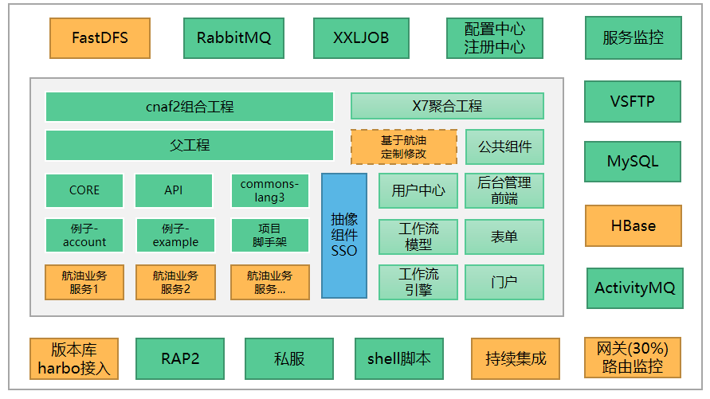
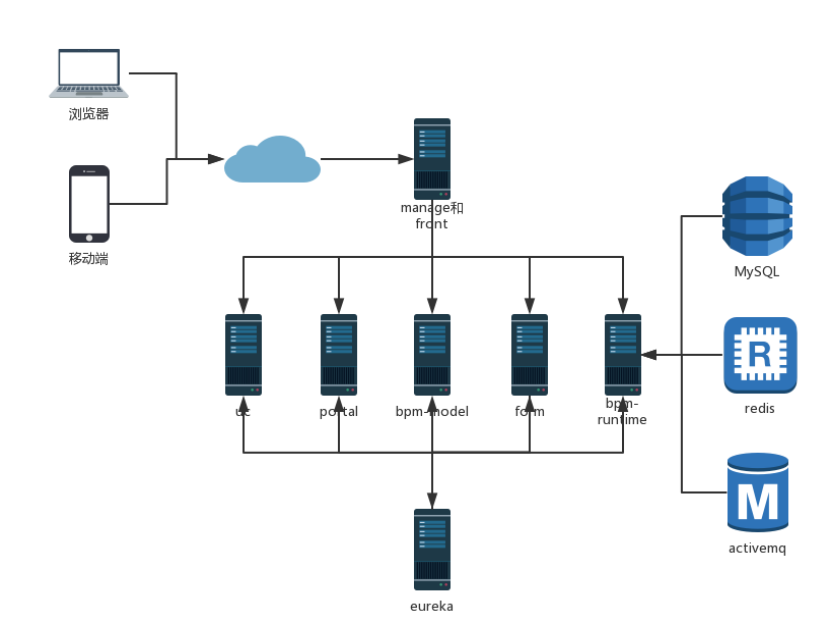
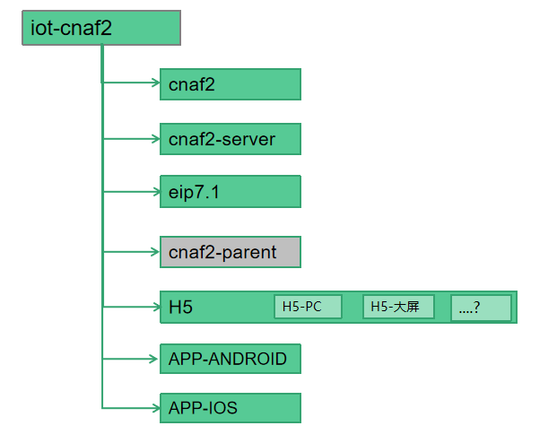

## 架构图



**说明**：

-黄色为未完成（其实x7下方有一个虚线，说明修订有可能分散在各个已有模块中）

-蓝色是x7与cnaf2关联组件之一（由x7的base与uc-api-impl抽取而得）

-其中：mysql可容器化、rap容器化、redis容器化、rabbitmq容器化

-目前未完成部分不影响业务开发

-脚本架用于生成实际业务微服务

-cnaf2聚合工程是x7的子集，用于完成航油二期业务系统开发


### X7架构图




## 目录规划


### 工程目录与gitlab仓库规划



说明：

- cnaf2：与航油相关的业务服务--独立库
- eip7.1: x7的5个服务与1个管理后台的前端--独立库
- cnaf2-server: 微服务之中心服务--独立库
- cnaf2-parent：可不放仓库，直接放私服上
- h5：前端程序集，未来是一个仓库还是多个仓库根据情况
	- 目录名：H5-XXX(比如 H5-pc，H5-BIGSCREEN、H5...
- APP-ANDROID
- APP-IOS 
- ...
	
### 目录详情

	```	
	- iot-cnaf2：根目录名
	  - cnaf2：与航油相关的业务服务
		- commons-lang3： 公共组件(redis等，一般不需要修改）
		- cnaf2-api: 服务之间需要调用
		- cnaf2-core： 核心的一些包，比如entity类、vo、bo等服务之间共享
		- cnaf2-sso: x7的登录-（基于security模块）			
		- cnaf2-account、cnaf2-example：工程实例
		- 根据脚手架生成工程，见“开发指南”
	- eip7.1: x7的5个服务
		- eip7.1-common：公共组件
			- base、 activemq、poi、redis、rest-auth-service、ueditor
		- eip7.1-bpm: 工作流相关
			- activiti、bpm:公共组件
			- bpm-model：微服务-工作流模型微服
			- bpm-runtime: 微服务-工作流运行时
		- eip7.1-form：自定义表单
			- bo:、table
			- form: 微服务-自定义表单服务
		- eip7.1-portal: 门户
			- calendar、file、i18n、im、job、mail、service、sys
			- portal: 门户-微服务（后台管理系统的主要功能集）
		- eip7.1-uc：用户中心
			- uc-api、uc-api-impl
			- uc： 微服务--用户中心	
		- web：x7后台管理系统前端（可用nodejs启动)
	- cnaf2-server: 微服务之中心服务
		- eureka-server：微服务
		- service-monitor: 服务运行监控
	- app: 用于存放app
		- APP-ios
		- APp-Androip
	- h5：所有H5的资源集
		- H5-pc
		- h5-bigscreen
		- 	 
	```

## 服务端资源	

- eureka

	- http://172.16.100.109:8761/
	- admin/admin
	
- nacos

	- sh startup.sh -m standalone
	- /opt/cnaf2-server/logs/start.out
	- http://172.16.100.108:8848/nacos/
	- nacos/nacos

- rabbitmq

	- http://172.16.100.108:15672
	- 默认用户/密码：admin/admin


- redis
	 - redis.host=172.16.100.108
	 - redis.port=6379
	 - redis.password=
	 - redis.database=15
	   - x7： 15
	   - sso: 15
	   - base: 14


- mysql
	- ip：172.16.100.109
	- x7/x7.1qazXSW@


- x7的5个服务+1个后台管理
	- http://172.16.100.109:3899/manage/#/login
	- admin/123456
	
- xxl-job
	- http://172.16.100.108:8765/xxl-job-admin/
	- admin/123456

- moitor
	- http://172.16.100.109:8769/
	- admin/admin


- nexus（辅助工具）
	- http://172.16.100.108:8081/
	- deploy/deploy.123
	- 匿名用户可浏览与下载软件包，已集成阿里、spring仓库

- activemq（后期可与rabbitmq合并，但比较轻量暂时可不用考虑）

	- 管理员界面
	  - http://127.0.0.1:8161/admin
	- 默认用户与密码
	  - admin/admin
	- x7默认队列

- rap2（辅助工具）

	- http://172.16.100.109/  
	- rap数据库:
	    - IP:
	    - ...
	- 帐号
	 - 用户名：xiaoling
	 - 邮箱：xiaoling@spacesystech.com
	 - 密码：123456

- vsftp（如x7有文件上上传需要）
	- ftp.host=172.16.100.109
	- ftp.username=ftptest
	- ftp.password= ftptest
	- ftp.port=1802
	

## 关键组件版本

（x7相关组件也已升级）

  - Springboot：2.2.5.RELEASE
  - SpringCloud: Hoxton.SR3(2.2.1.RELEASE) -——nacos需要
  - Nacos-client：1.1.4
  - spring-cloud-alibaba-nacos: 2.2.0.RELEASE
  - seata-all: 1.0.0
  - httpclient.version: 4.5.2
  - mysql：慎用V8版本
  - druid:1.1.21
