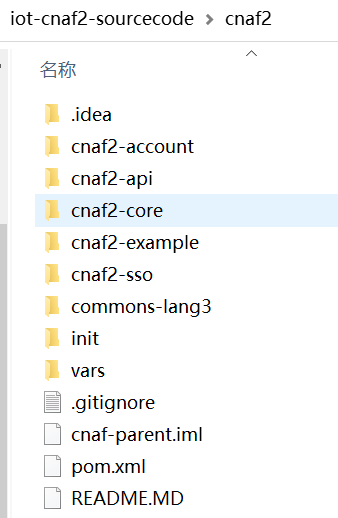
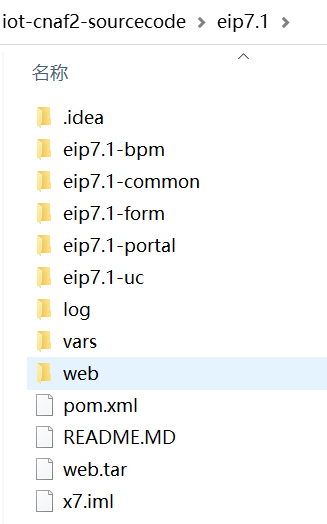

## 开发环境
### jdk1.8
### maven
- 环境变量:path=...;$MAVEN_HOME$/bin (LINUX桌面自行百度）
- 配置host(私服）
  
	```
   	172.16.100.108  nexus.915zb.com    nexus.915zb.com
    ```
- 将工程中的setting.xml复制到$MAVEN_HOME$/conf下
  
**setting.xml可在工程init/setting.xml中取得**
  
### git
### IDEA或ecipse
### mysql客户端
### nodejs

	选型依据：目前主流前后端分离，开发环境中web服务集成工具

##IDE配置

### IDEA与eclipse兼容配置

父工程对eclipse的集成做了优化，该优化需配置idea兼容。

即解决maven org.eclipse.m2e:lifecycle-mapping 在Idea中无法使用的处理方式。
	

	$ git clone https://github.com/mfriedenhagen/dummy-lifecycle-mapping-plugin.git
	$ cd dummy-lifecycle-mapping-plugin
	$ mvn install

### 需要修改 IDEA或ECLIPSE对应的MAVEN路径

具体请百度

## cnaf2-项目启动

### 下载代码

	mkdir d:/iot-cnaf2
	cd d:/iot-cnaf2
	git clone ../cnaf2

	
### 将工程导入到IDE中

过程百度，工程结构如下

|| 


### 查看配置信息是否正确

../var/var.dev.properties文件

1. 数据库链接
2. EUREK配置
3. monitor服务
4. nacos配置
5. redis配置
6. 日志目录
7. mysql配置
	1. cnaf2：工程中的链接是例子数据库


### 确保注册中主与配置中心

确保注册中心(EUREKA)与配置服务(nacos）在服务器上正常运行

不建议本地启动注册中心与配置中心

说明：目前消息服务例子相关的配置信息，放在nacos上

### 工程编译

分别进入cnaf2工程目录，执行

```
mvn clean compile

```

### 启动例子工程

注：数据库等配置信息已配置好

#### AccountApplication
#### ExampleApplication

### 访问

	http://localhost:3803/swagger-ui.html
	http://localhost:3801/swagger-ui.html

###例子工程提供的功能说明

例子用到两张表Account与Order个

- rabbitMQ接入
- redis接入、设置
- 订单列表与分页
- feign应用(采购：创建订单、远程调用扣款）
- 订单添加、查询、删除
- sso引入与过滤器
	- 无权限过滤的路劲有（/example /echo /auth ..)
- 动态版本号
- SpringUtil等工具集
- 单元测试
	- 集成Controller测试
	- 集成服务测试功能
	- 读取token
	- 指南：如何查看测试结查

- swagger的引入（不建议做深度接口配置）
 - 可展示多个包的api描述  

### 工程脚手架

可生成cnaf2的聚合工程的子工程，每一个子工程代表一个微服务，具体见下方描述	


## x7项目启动

### 下载代码

	mkdir d:/iot-cnaf2
	cd d:/iot-cnaf2
	git clone ../eip7.1

### 导入IDE中

过程自行百度，工程结构如下：



### 检查本置信息

/var/var.dev.properties  
main/resource/application.yml

**说明** 

五个服务指向同一个数据库

### 检测EUREKA是否启动 

### activityMQ、FTP等是否正常启动

### 编译

```

	mvn clean compile

```
	
### 启动工程-后台服务

- eip7.1-uc--> uc  
- eip7.1-bpm-->bpm-model
- eip7.1-bpm-->bpm-runtime
- eip7.1-form-->form
- eip7.1-portal-->portal
- eip7.1-portal-->web （见“x7后台管理-开发环境启动方式(需nodejs支持)"


### 启动工程-后台管理-前端


- 1、环境安装(nodejs支持)

```
	cd d:/iot-cnaf2/eip7.1/web/src/main
	npm install cnpm -g --registry=https://registry.npm.taobao.org
	npm install express
```

-2、创建server.js

	```

	const express = require('express')
	const path = require('path')
	const app = express()
	
	app.use(express.static(path.join(__dirname, 'webapp')))
	
	app.listen(3899, () => {
	  console.log('App listening at port 3899')
	})

	```


- 3、修改/webapp/manage/js/app/app.js

	
```
	
	web : 'http://172.16.100.109:3899/manage',
	frontVue:'#',//前端页面
	portal: 'http://172.16.100.109:8084',
	bpmRunTime: 'http://172.16.100.109:8086',
	bpmModel: 'http://172.16.100.109:8087',
	uc:'http://172.16.100.109:8088',
	form:'http://172.16.100.109:8082'

```

-4、启动服务

```

node server.js

```


## cnaf2-微服务工程脚手架

通过开发流程说明脚手架构建服务

### 开发流程

- 1、需求分析
- 2、系统设计
 - 在已有工程开发
 - 新开微服务开发
  - 工程编码：比如值班duty
  - [创建微服脚手架](#生成业务微服务脚手架)并将项目加入到cnaf2中
- 3、编写接口
 - feign接口：用于服务是调用
 - api接口：终端与后台服务
- 4、代码开发
- 5、单元测试
- 6、提交uat测试
- ...


### 生成业务微服务脚手架

**在值班管理系统，工程编写为duty为例。 **

编码作用：

1. 目录结构名
2. 包名
3. 微服务名
4. 启动文件名等重要核心标识

- 1、前提条件

	需要按要求配置maven的setting.xml

- 2、进入cnaf2工程集

```
cd d:/iot-cnaf2/cnaf2

```

- 3、运行如下命令

**说明：实际工作中，需要将下列命令中duty换成实际工程编码**
	
	mvn archetype:generate -DarchetypeGroupId=com.aszsst  -DarchetypeArtifactId=cnaf2-template-archetype -DarchetypeVersion=1.0.1-SNAPSHOT -DgroupId=com.aszsst -DartifactId=cnaf2-duty -Dversion=1.0.1-SNAPSHOT -Dpackage=com.aszsst.cnaf2.duty -DinteractiveMode=false 
	
	

- 4、将工程加入到主pom.xml
	```
	  <module>cnaf2-duty</module>   
	```
- 5、用IDEAL或Eclipse打开工程，做如下配置修改
 - 1、application.yaml中修改端口
	
```

	server:
	  port: 380x #改未用的端口，规则是 3805、3807、3809，以此类推。3801和3803已用
	...
	management:
	  server:
	    port: 380x #改为未用的端口，规则是3806、3810、3812，以此类推。3802和3804已用
    
	#redis:  #注掉相关配置--需要时再打开，并连到正确的地址与db上
    # ...
    # jedis:
	#	


	xxl:
	  job:
	    admin:
	      addresses: @@xxl-job-admin@@
	    executor:
	      appname: @@project.artifactId@@
	      ip:
	      port: 9999  #端口从9995递减 9995 9993 往下递减  9997和9999例子在用
	      logretentiondays: 30
	    accessToken:
	    logpath: @@log.path@@
    
```
 - 2、Maven脚手架默认编码并非utf-8解决
 
   Maven脚手架默认编码并非utf-8，因为某些文件可能存在编码问题。由于时间关系，在此不修该问题修改，解决办法：**从cnaf2/init/resources中将对应文件复制到 工程/main/resources下，并覆盖。**
	
 - 3、给ExampleApplication.java文件改名 
   - 改为DutyApplication.java
   - 同时注意修改DutyApplication.java文件内的三处引用
   - 及AppTestCase.java中对其的引用
 
 - 4、去掉controller中的例子程序
  - ExampleMQController.java(必须）
  - ExampleController.java（可选）
  - ExampleVersionController.java（可选） 
  - ....

- 5、/var/var.dev.properties

   修改文件中中添加正确的数据库与redis等参数，并将这些参数就用到application.yml与并将这些参数就用到application-db.yml文件中

- 7、编译运行
- 8、运行或查看结果

 **eureka上可以看到该工程**

 **http://localhost:端口/swagger-ui.html简易接口说明**

## 框架集成的核心功能

- 1、druid+mybaits+pagehelper：创建、修改、分页列表
- 2、redis用法
- 3、分布式定时服务
- 4、注册中心
- 5、配置中心（如不想用，可移除）
- 6、rabbitMQ消息（接收与发送）
- 7、分布式任务调度
- 8、微服务脚手架
- 9、代码生成器（待完善）
- 10、feign最优实践
- 11、动态api版本管理
- 12、常用工具集
- 13、spring-security登录
- 14、...


框架集成功能详述，见相关章节

- 03、编程规范
- 06、集成功能
- 04、微服务组件

迭代完善功能，见“10、关于”章节


