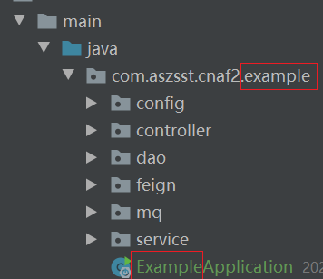
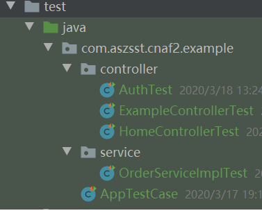

## 程序结构

-工程主体上遵循maven的结构。在此不做详述，主要描述与实际工程相关的内容。

### 聚合工程名

- cnaf2-工程编码，比如cnaf2-duty、cnaf2-example

### maven-pom.xml头部规则

	   <parent>
	        <groupId>com.aszsst</groupId>
	        <artifactId>cnaf2-parent</artifactId>
	        <version>1.0.1-SNAPSHOT</version>
	        <relativePath>../pom.xml</relativePath>
	    </parent>
	    <artifactId>cnaf2-template</artifactId>
	    <packaging>jar</packaging>
	    <name>aszsst-${project.artifactId}</name>
	    <properties>
	        <project.build.sourceEncoding>UTF-8</project.build.sourceEncoding>
	    </properties>


- artifactId名为：cnaf2-工程编码
- groupId和version：原则上不另行定义-继续父工程

### 包名
	
	- com.aszsst.cnaf2.[工程编码]
		- config：配置
		- feign：feign服务的实现
		- controller:前端调用...
		- mq: 消息
		- dao: dao层引用
		- service：服务的接口
			- impl：服务实现 
		- [工程编码]Application.java #工程主文件名


**主包**



**测试包**



### 文件名

- Java首字母大写，后面驼峰规则
- h5、jsp、freemark等模板文件：首字小母小写，后面驼峰规则

## 前端文件夹

其他按主流框架结构

- css
- img
- js
- html
- <某前端框架>
- ...

## 数据库

如果多个工程共享一个数据库，表前加前缀"工程编码_xxx业务"

## redis's key规则

1、统一定义在cnaf2-core/constant/RedisConstant.java类中
2、key由 <前缀> + ":" + <KEY模板> 组成
 
	  前缀：工程编码[_模块名]
		
	  KEY模板：[模块名_]功能[_列表|查询等动作名]_{变量名1}_{变量名2}_...以此类推
	
	  其中：变量名x可以用实际的变量值代替

	
4、key生成例子如下

```

        String key= new RedisKV(RedisConstant.PREFIX_EXAMPE,RedisConstant.PATTERN_ACCOUNT_LIST)
                .build("pagenum",currentPage.toString())
                .build("pagesize",pageSize.toString())
                .finish();

        redisService.add(key,ids,1000);//正常情况下，可以用Redis的set类型，这里只是作为例子，故没做处理。


```